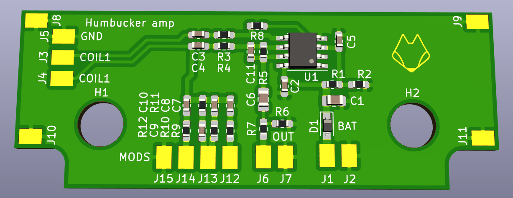
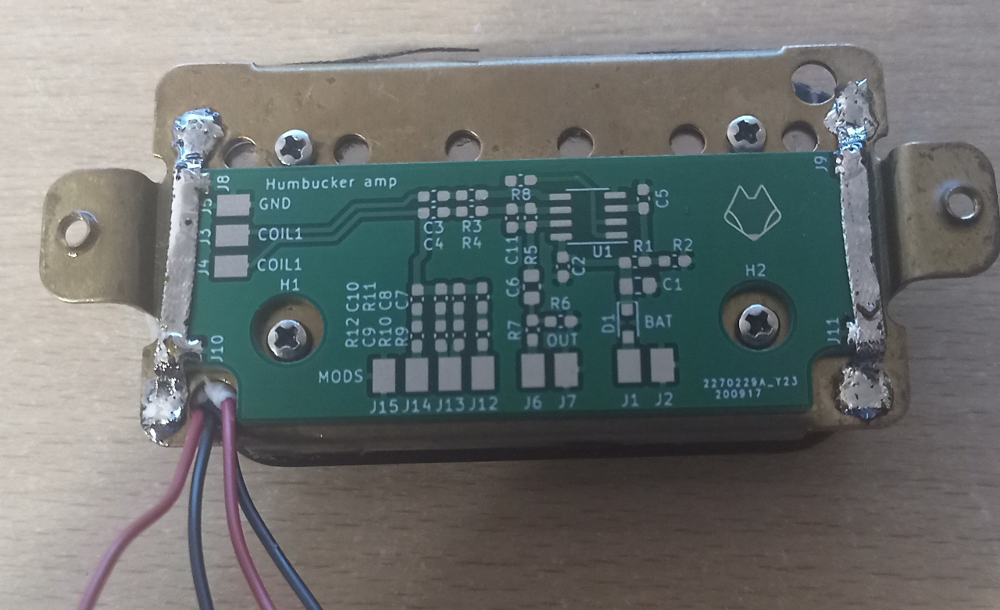
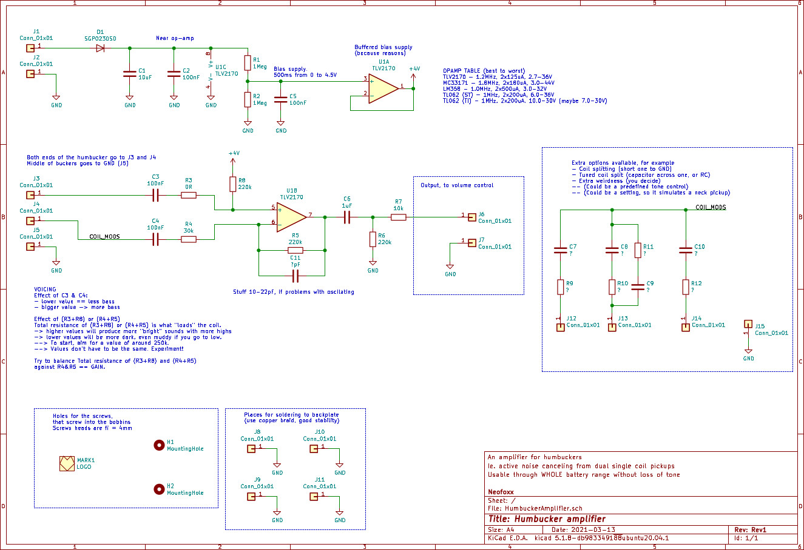

# HumbuckerAmplifier
An amplifier for humbucking pickups (like other popular brands). Just a bit cheaper and more versatile.

#### Render

#### Mounting

#### Schematic

## Description
This is an amplifier for humbucking pickups. It takes two coils, with one side of each connected to GND, and the other to the input. Take care to connect properly, otherwise you will get a noise amplifier :) (in-phase sound will cancel, and out-of-phase noise will amplify).

**Note, you need either a 4-wire pickup, or some soldering skills. You cannot use a series humbucker, or a parallel humbucker**

The curcuit uses a dual opamp, so you can play around with voicing without fear of power supply modulation distortion etc.

A TLV2170 will give great results, as will an MC33171. Other opamps like TL072 or TL062 will be *OK*, but in that case I suggest upping the voltage to 18V. Consult the schematic.

## Features

- Gain can be as high as you want, but be warned that amps usually have limited input headroom, so beyond some point "making it louder" will have a negative effect.

- The circuit is usable throught the batteries entire range. Works just find with power-switching on the output jack (TRS jack, short R (Bat-) and S (GND)).

- Since this is a one-sided board, it can be easily made at home.

- **REVERSE POLARITY PROTECTION**

- The circuit board should fit comfortably under a humbucker, but you can relocate it if you want to.

- Use desoldering braid to mount the PCB to the board (see pictures)

## Voicing
The circuit is quite versatile, as there are multiple positions prepared for mods & voicing.

### Basic voicing
Voicing can be done in these ways:

- Capacitors C3 and C4 define how lows are passed through. Small value == less lows, more highs. There reverse is true for Big values.

- Value of (R3+R8) and (R4+R5) define the "loading" of each coil. This defines the resonance peak. Think how a single coil "needs" 250k pots, and humbuckers need "500k" pots. Higher values will shift the resonance higher, and can produce "shrill" or ice pick-y sounds. Lower values will shift the resonance down, and make a more mellow, or muddy tone.

- The value of (R3+R8) and (R4+R5) doesn't have to be the same. C3 and C4 as well. Experiment with values, trust your ears.

- Gain is defined with R4 and R5. Gain = 1 + (R5/R2). Well, it also depends on (R3 and R8), but in practice you can just go with the simple forumla.

- C11 is there to help you if you go crazy with gain. A few pF is all you need usually.

### Advanced voicing
There are some footprints prepared for extra voicing. You can then connect a switch/push-pull pot/? between those footprints and GND, to spice things up.
Some examples /w speculation:
- C7 = 0ohm jumper, R9 = 220k. This will shift the resonance of one coil down. This can help spread the gain on higher frequencies more evenly.
- C10 = 2.2nF, R12 = 0ohm, This is like a selective filter. Should give you a bit of a bass boost.
- C8, C9, R10 and R11 are prepared just so you can do some funky stuff. Can also place something like a diode there, or inductors, etc. Dunno, go nuts.
- C7 = 0ohm, R9 = 0ohm. This will short a coil, and effectively give you a single coil with **GAIN**. But this also means no noise canceling, so YMMV.

#### But what about audio grade capacitors??
No amount of NOS PIO capacitors, carbon resistors and magic smoke in the form of vintage opamps will improve your sound as much as practice will.

## Files
* The Gerber files are in the HW/Gerbers directory
* The BOM is in the HW/ibom directory
* The schematic is here in the root directory